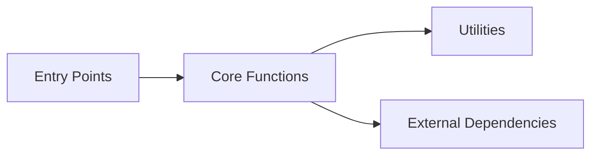

# Codebase Context

**Generated:** 2026-01-01
**Purpose:** Quick codebase understanding for humans and AI agents

## Overview

- **Source Directory:** `C:\Users\willh\Desktop\assistant`
- **Languages:** ts, tsx, js, jsx
- **Total Files:** 7
- **Total Elements:** 55

## Entry Points

### Methods

- **init** - `C:/Users/willh/Desktop/assistant/docs/js/app.js:2`
- **renderDocList** - `C:/Users/willh/Desktop/assistant/docs/js/app.js:28`
- **loadDocument** - `C:/Users/willh/Desktop/assistant/docs/js/app.js:40`
- **if** - `C:/Users/willh/Desktop/assistant/docs/js/app.js:13`
- **catch** - `C:/Users/willh/Desktop/assistant/docs/js/app.js:16`
- **if** - `C:/Users/willh/Desktop/assistant/docs/js/app.js:42`
- **catch** - `C:/Users/willh/Desktop/assistant/docs/js/app.js:47`
- **catch** - `C:/Users/willh/Desktop/assistant/docs/js/app.js:76`
- **initializeSidebarToggle** - `C:/Users/willh/Desktop/assistant/documentation-site/js/app.js:16`
- **init** - `C:/Users/willh/Desktop/assistant/documentation-site/js/app.js:51`
- **renderDocList** - `C:/Users/willh/Desktop/assistant/documentation-site/js/app.js:80`
- **loadDocument** - `C:/Users/willh/Desktop/assistant/documentation-site/js/app.js:97`
- **if** - `C:/Users/willh/Desktop/assistant/documentation-site/js/app.js:28`
- **if** - `C:/Users/willh/Desktop/assistant/documentation-site/js/app.js:64`
- **catch** - `C:/Users/willh/Desktop/assistant/documentation-site/js/app.js:67`
- **if** - `C:/Users/willh/Desktop/assistant/documentation-site/js/app.js:99`
- **catch** - `C:/Users/willh/Desktop/assistant/documentation-site/js/app.js:104`
- **catch** - `C:/Users/willh/Desktop/assistant/documentation-site/js/app.js:132`
- **if** - `C:/Users/willh/Desktop/assistant/documentation-site/server.js:11`
- **if** - `C:/Users/willh/Desktop/assistant/documentation-site/server.js:29`
- **if** - `C:/Users/willh/Desktop/assistant/documentation-site/server.js:30`
- **startPythonServer** - `C:/Users/willh/Desktop/assistant/web/main.js:13`
- **stopPythonServer** - `C:/Users/willh/Desktop/assistant/web/main.js:35`
- **createWindow** - `C:/Users/willh/Desktop/assistant/web/main.js:42`
- **if** - `C:/Users/willh/Desktop/assistant/web/main.js:36`
- **if** - `C:/Users/willh/Desktop/assistant/web/main.js:77`
- **if** - `C:/Users/willh/Desktop/assistant/web/main.js:87`
- **if** - `C:/Users/willh/Desktop/assistant/web/main.js:108`

### Constants

- **STATE_KEY** - `C:/Users/willh/Desktop/assistant/documentation-site/js/app.js:21`
- **PORT** - `C:/Users/willh/Desktop/assistant/documentation-site/server.js:5`
- **ROOT_DIR** - `C:/Users/willh/Desktop/assistant/documentation-site/server.js:6`

## Critical Functions

Top 20 functions by importance:

1. **addEventListener** (score: 0) - `C:/Users/willh/Desktop/assistant/coderef/user/components.js:33`
2. **if** (score: 0) - `C:/Users/willh/Desktop/assistant/coderef/user/components.js:36`
3. **if** (score: 0) - `C:/Users/willh/Desktop/assistant/coderef/user/components.js:42`
4. **if** (score: 0) - `C:/Users/willh/Desktop/assistant/coderef/user/components.js:47`
5. **initNavigation** (score: 0) - `C:/Users/willh/Desktop/assistant/coderef/user/navigation.js:4`
6. **closeDrawer** (score: 0) - `C:/Users/willh/Desktop/assistant/coderef/user/navigation.js:22`
7. **if** (score: 0) - `C:/Users/willh/Desktop/assistant/coderef/user/navigation.js:10`
8. **addEventListener** (score: 0) - `C:/Users/willh/Desktop/assistant/coderef/user/navigation.js:16`
9. **if** (score: 0) - `C:/Users/willh/Desktop/assistant/coderef/user/navigation.js:36`
10. **addEventListener** (score: 0) - `C:/Users/willh/Desktop/assistant/coderef/user/navigation.js:47`
11. **init** (score: 0) - `C:/Users/willh/Desktop/assistant/docs/js/app.js:2`
12. **renderDocList** (score: 0) - `C:/Users/willh/Desktop/assistant/docs/js/app.js:28`
13. **loadDocument** (score: 0) - `C:/Users/willh/Desktop/assistant/docs/js/app.js:40`
14. **if** (score: 0) - `C:/Users/willh/Desktop/assistant/docs/js/app.js:13`
15. **catch** (score: 0) - `C:/Users/willh/Desktop/assistant/docs/js/app.js:16`
16. **if** (score: 0) - `C:/Users/willh/Desktop/assistant/docs/js/app.js:42`
17. **catch** (score: 0) - `C:/Users/willh/Desktop/assistant/docs/js/app.js:47`
18. **catch** (score: 0) - `C:/Users/willh/Desktop/assistant/docs/js/app.js:76`
19. **initializeSidebarToggle** (score: 0) - `C:/Users/willh/Desktop/assistant/documentation-site/js/app.js:16`
20. **init** (score: 0) - `C:/Users/willh/Desktop/assistant/documentation-site/js/app.js:51`

## Architecture Patterns

- **Error Handling:** 6 try-catch blocks
- **Barrel Exports:** 0 export-from statements
- **Decorators:** 0 decorator usages
- **Async/Await:** 4 async functions

## Dependency Graph

### Statistics

- **Nodes:** 74
- **Edges:** 100
- **Circularity:** 0.0%
- **Isolated Nodes:** 0

### Visualization

*Note: Run `pnpm start diagram ./src` for detailed dependency diagram*

## Health Metrics

- **Test Coverage:** Unknown
- **Avg Complexity:** 1.4
- **Maintainability:** Good

---

*Generated by CodeRef Context Generator*
*Run `pnpm start context ./src` to regenerate*