# CodeRef Ecosystem Architecture

Visual representation of all 7 MCP servers and their dependencies.

```mermaid
graph TD
    %% CodeRef Ecosystem Architecture

    context[Context<br/>Code Intelligence]
    docs[Docs<br/>Documentation]
    personas[Personas<br/>Expert Agents]
    workflow[Workflow<br/>Planning & Orchestration]
    testing[Testing<br/>Test Automation]
    papertrail[Papertrail<br/>Audit Trail]
    archived[Archived<br/>Legacy MCP]


    %% Styling
    classDef core fill:#4CAF50,stroke:#2E7D32,color:#fff
    classDef support fill:#2196F3,stroke:#1565C0,color:#fff
    classDef archived fill:#9E9E9E,stroke:#616161,color:#fff

    class context,docs,workflow core
    class personas,testing,papertrail support
    class archived archived
```

## Legend

- **Core Servers** (Green): Primary functionality - context, docs, workflow
- **Support Servers** (Blue): Secondary features - personas, testing, papertrail
- **Archived** (Gray): Legacy/deprecated servers

## Dependency Summary

- **Total Dependencies:** 0
- **Servers with Dependencies:** 0
