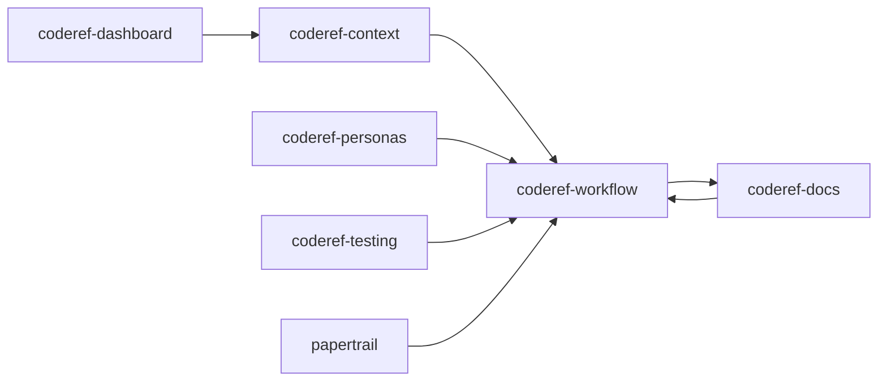

# CodeRef Discovery Workflow - v1→v2 Refactor

**Workorder:** WO-CODEREF-V2-REFACTOR-001
**Phase:** 1 - Discovery & Inventory
**Created:** 2025-12-31

---

## Objective

Use CodeRef tools to discover architecture, dependencies, and refactor targets across all 7 MCP servers without manual code reading.

---

## Step 1: Generate .coderef/ Structures (Automated)

**Goal:** Create code intelligence baseline for all 7 servers

**Method A: Using MCP Tool (Recommended)**
```
For each server in [coderef-context, coderef-workflow, coderef-docs, coderef-personas, coderef-testing, papertrail, coderef-dashboard]:
  Call mcp__coderef-context__coderef_scan({
    project_path: "C:\\Users\\willh\\.mcp-servers\\{server}",
    languages: ["py"],
    use_ast: true
  })
```

**Method B: Using Script (Alternative)**
```bash
# Run for each server
python C:\Users\willh\Desktop\projects\coderef-system\scripts\populate-coderef.py \
  C:\Users\willh\.mcp-servers\coderef-context

python C:\Users\willh\Desktop\projects\coderef-system\scripts\populate-coderef.py \
  C:\Users\willh\.mcp-servers\coderef-workflow

# ... repeat for all 7 servers
```

**Output:**
```
{server}/.coderef/
├── index.json              # All functions, classes, methods
├── context.md              # Human-readable overview
├── reports/
│   ├── patterns.json       # Design patterns
│   ├── coverage.json       # Test coverage
│   └── complexity/         # Complexity metrics
├── diagrams/
│   ├── dependencies.mmd    # Mermaid diagram
│   └── dependencies.dot    # GraphViz diagram
└── exports/
    └── graph.json          # Complete graph export
```

**Time:** ~5-10 minutes total (all 7 servers)

---

## Step 2: Map Cross-Server Dependencies

**Goal:** Discover which servers import/call which

**Method: coderef_query (imports)**

```
For each server:
  1. Read {server}/.coderef/index.json
  2. Extract all import statements
  3. Filter for cross-server imports (e.g., coderef-workflow importing from coderef-docs)

Example:
  Call mcp__coderef-context__coderef_query({
    project_path: "C:\\Users\\willh\\.mcp-servers\\coderef-workflow",
    query_type: "imports-me",
    target: "coderef_docs"
  })
```

**Output:** DEPENDENCIES.md
```markdown
## Cross-Server Dependencies

| Server | Imports From | Import Count |
|--------|--------------|--------------|
| coderef-workflow | coderef-docs | 18 (generators) |
| coderef-docs | coderef-workflow | 18 (generators) |
| coderef-personas | coderef-workflow | 3 (plan executors) |
```

**Alternative (Faster):** Read .coderef/index.json directly
```python
import json

# Read index
with open(".coderef/index.json") as f:
    index = json.load(f)

# Extract imports
imports = [e for e in index if e.get("type") == "import"]

# Filter cross-server
cross_server = [i for i in imports if "coderef-" in i.get("target", "")]
```

---

## Step 3: Identify Shared/Duplicated Code

**Goal:** Find the 18 generators duplicated across workflow/docs

**Method: Pattern matching across .coderef/index.json files**

```python
# Read both indexes
workflow_index = json.load(open("coderef-workflow/.coderef/index.json"))
docs_index = json.load(open("coderef-docs/.coderef/index.json"))

# Extract function/class names
workflow_elements = {e["name"] for e in workflow_index if e["type"] in ["function", "class"]}
docs_elements = {e["name"] for e in docs_index if e["type"] in ["function", "class"]}

# Find duplicates
duplicates = workflow_elements & docs_elements

print(f"Shared elements: {len(duplicates)}")
for name in sorted(duplicates):
    print(f"  - {name}")
```

**Output:** SHARED-CODE.md
```markdown
## Duplicated Code Analysis

### Generators (18 shared between workflow/docs)
1. planning_generator.py
2. foundation_generator.py
3. coderef_foundation_generator.py
4. changelog_generator.py
... (14 more)

### Recommendation
- Option A: Create shared library (coderef-generators)
- Option B: Keep duplicated (server isolation)
- Option C: Use symlinks (Windows compatibility issue)
```

---

## Step 4: Generate Visual Dependency Diagrams

**Goal:** Visualize architecture across all 7 servers

**Method: coderef_diagram**

```
Call mcp__coderef-context__coderef_diagram({
  project_path: "C:\\Users\\willh\\.mcp-servers\\coderef-workflow",
  diagram_type: "dependencies",
  format: "mermaid",
  depth: 3
})
```

**Output:** 7 × Mermaid diagrams

Then **combine** into ecosystem diagram:


**Save as:** ECOSYSTEM-ARCHITECTURE.mmd

---

## Step 5: Analyze Complexity & Refactor Targets

**Goal:** Identify high-complexity code that needs refactoring

**Method: coderef_complexity + .coderef/reports/complexity/**

```
For each server:
  1. Read .coderef/reports/complexity/{file}.json
  2. Filter functions with cyclomatic_complexity > 15
  3. Filter functions with cognitive_complexity > 20

Example:
  Call mcp__coderef-context__coderef_complexity({
    project_path: "C:\\Users\\willh\\.mcp-servers\\coderef-workflow",
    element: "planning_generator.py"
  })
```

**Output:** REFACTOR-TARGETS.md
```markdown
## High-Complexity Targets

| Server | File | Function | Cyclomatic | Cognitive | Priority |
|--------|------|----------|------------|-----------|----------|
| coderef-workflow | planning_generator.py | create_plan() | 28 | 42 | High |
| coderef-docs | foundation_generator.py | generate_architecture() | 22 | 35 | Medium |
```

---

## Step 6: Extract Patterns for Standardization

**Goal:** Discover existing patterns to standardize across servers

**Method: coderef_patterns**

```
Call mcp__coderef-context__coderef_patterns({
  project_path: "C:\\Users\\willh\\.mcp-servers\\coderef-workflow",
  pattern_type: "error_handling"  // or api_patterns, state_management
})
```

**Output:** PATTERNS-ANALYSIS.md
```markdown
## Discovered Patterns

### Error Handling
- **Workflow:** Uses try/except with error_responses.py helper
- **Docs:** Uses try/except with custom error classes
- **Recommendation:** Standardize on error_responses.py across all servers

### Logging
- **Workflow:** Uses logger_config.py (structured logging)
- **Docs:** Uses print statements
- **Recommendation:** Migrate all servers to logger_config.py
```

---

## Step 7: Export Full Graph for Analysis

**Goal:** Export complete code graph for external analysis

**Method: coderef_export**

```
Call mcp__coderef-context__coderef_export({
  project_path: "C:\\Users\\willh\\.mcp-servers\\coderef-workflow",
  format: "json",
  output_path: "coderef-workflow-graph.json"
})
```

**Use case:** Import into Neo4j or analyze with graph algorithms to find:
- Circular dependencies
- Orphaned code
- Critical paths
- Refactor opportunities

---

## Discovery Outputs Summary

After completing all 7 steps, you will have:

| File | Content | Size | Location |
|------|---------|------|----------|
| **7 × .coderef/** | Complete code intelligence | 50KB-2MB each | Each server root |
| **DEPENDENCIES.md** | Cross-server import matrix | 5-10KB | This workorder folder |
| **SHARED-CODE.md** | Duplicated code analysis | 5-10KB | This workorder folder |
| **ECOSYSTEM-ARCHITECTURE.mmd** | Visual dependency diagram | 2-5KB | This workorder folder |
| **REFACTOR-TARGETS.md** | High-complexity functions | 10-20KB | This workorder folder |
| **PATTERNS-ANALYSIS.md** | Pattern recommendations | 10-20KB | This workorder folder |
| **7 × {server}-graph.json** | Full graph exports | 100KB-5MB each | This workorder folder |

**Total Time:** 30-60 minutes (fully automated)

---

## Key Advantages of This Approach

1. **No Manual Code Reading:** All discovery via .coderef/ data
2. **Comprehensive:** Analyzes 100% of codebase (not just samples)
3. **Fast:** 30-60 min vs 10-20 hours manual analysis
4. **Accurate:** AST-based (99% accuracy vs 85% regex)
5. **Reproducible:** Can re-run anytime code changes
6. **Queryable:** .coderef/ data enables ad-hoc queries

---

## Next Steps

After discovery complete:
1. Review all 6 output documents
2. Identify refactor scope per server
3. Create 7 individual workorders (Phase 3)
4. Begin v1→v2 refactor with full context

---

**Maintained by:** CodeRef Assistant (Orchestrator)
